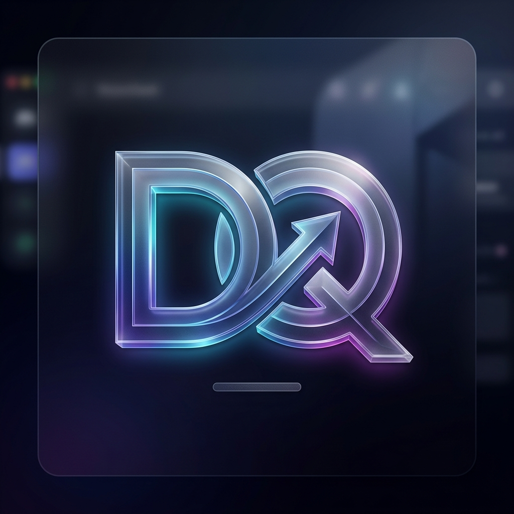

  
  <h1>Discord Quest Auto   Web UI Edition 🚀</h1>
  

    Tự động hóa hoàn toàn quá trình stream nhận thưởng Discord Quest với giao diện Web siêu việt.
  

  

    <b>An Toàn</b> • <b>Không Cài Game</b> • <b>Không Cần Treo Máy</b>
  

---

## ✨ Tính Năng Nổi Bật (Features)

- 🎨 **Web UI Hiện Đại:** Giao diện tối giản, sang trọng (Glassmorphism), mượt mà nhờ Lenis scroll và TailwindCSS.
- ⚡ **Zero Setup:** Không cần cài đặt game, không tải thêm phần mềm nặng nề. Mọi thứ được xử lý ngầm qua API.
- 🔒 **An Toàn Tuyệt Đối:** Request được mã hóa trực tiếp thông qua token định danh cá nhân của bạn. Không lưu trữ token, an toàn 100%.
- 📡 **Real-time Console:** Theo dõi trực tiếp tiến trình auto (nhận quest, xem video, stream) ngay trên trình duyệt với terminal log sinh động.
- 📱 **Fully Responsive:** Hoạt động hoàn hảo trên mọi thiết bị (PC, Tablet, Mobile).

---

## 🚀 Hướng Dẫn Sử Dụng (How to Use)

### 1. Triển Khai (Deploy)
Dự án được viết bằng Python (Flask) và đã cấu hình sẵn để dễ dàng deploy:
- **Local:** `pip install -r requirements.txt` sau đó chạy `python app.py` -> Mở `http://localhost:5000`
- **Cloud:** Sẵn sàng deploy lên Render, Railway, hoặc VPS (Lưu ý: Nếu dùng Vercel, tiến trình background có thể bị ngắt do giới hạn Serverless).

### 2. Cách Lấy Token Discord
1. Mở Discord Web trên trình duyệt và đăng nhập.
2. Bật công cụ Developer Tools (`F12` hoặc `Ctrl+Shift+I`) -> Chọn tab **Network**.
3. Gõ `/api/` vào ô Filter.
4. Click vào một request bất kỳ (VD: _science_), tìm dòng `Authorization` ở phần **Request Headers** và copy đoạn mã.
5. Dán vào hệ thống Web UI để bắt đầu tự động hóa!

---

## 🛠️ Công Nghệ Sử Dụng (Tech Stack)

- **Backend:** Python 3, Flask, Requests
- **Frontend:** HTML5, TailwindCSS, Vanilla JS, Lenis Scroll
- **Tối Ưu Hoá:** Tích hợp SEO Meta Tags, Open Graph

---

## 📝 Bản Quyền & Tác Giả (Credits)

- **Original CLI Script:** [@thanhdo1110](https://github.com/thanhdo1110/Discord-Quest-Auto-Completer) - Tác giả của lõi logic CLI gốc. 
- **Web UI Remaster:** [@tanbaycu](https://github.com/tanbaycu) - Thiết kế, tối ưu hoá và phát triển toàn bộ giao diện Web UI.

> ⚠️ **Lưu ý:** Dự án này là mã nguồn mở (Open Source) và nghiêm cấm sử dụng cho mục đích thương mại.
